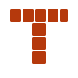

# 🧱 Terracotta Linux Branding

**Brand assets and identity for Terracotta Linux**, the distribution built on [Kiln](https://github.com/Terracotta-Linux/kiln).

---

## 🏺 What's in here

This repo is the **source of truth for Terracotta's brand**: the logo, color palette, boot
splash, wallpapers, and the Arch packages that ship them all. It's source files (SVGs,
palette tokens, the `os-release` file), not a rendered style guide.

| Path | Contents |
|---|---|
| `logo/` | The **T** mark: flat, monochrome, and badge variants |
| `brand/palette.md` | Named color tokens (light + dark context) |
| `brand/os-release` | The `/usr/lib/os-release` file for Kiln-built images |
| `plymouth/` | The `terracotta` boot splash theme |
| `wallpaper/` | Default desktop wallpapers, 4K and 1080p |
| `packaging/` | `PKGBUILD` and install hooks for the split package |
| `scripts/pacman` | A guard script pointing live systems at Kiln instead of `pacman` |

## ✨ Name

**Terracotta**, Italian *terra cotta*, "baked earth." Unglazed, fired clay: the *product* of
firing, not the process or the vessel that holds it. Kiln fires a TOML config into an OSTree
image the same way a kiln fires raw clay into terracotta, so the name pairs with the tool
instead of duplicating it: **Kiln builds it, Terracotta boots it.**

## 🎨 Mark

`logo/terracotta.svg` is a **T** built from stacked, mortar-gapped brick rectangles.
Terracotta's other life is fired construction brick, not just pottery, so the mark leans on
that instead of a vessel silhouette. It reads as brick-and-mortar at a glance and stays
legible at favicon size because the gaps are structural, not decorative detail that
disappears first when a mark shrinks.

&nbsp;&nbsp;&nbsp;
&nbsp;&nbsp;&nbsp;

| File | For |
|---|---|
| `terracotta.svg` | Standard flat-color mark, transparent background |
| `terracotta-mono.svg` | Single-color (`currentColor`), for the GRUB theme, Plymouth splash, man pages, anywhere that can't render the full palette |
| `terracotta-badge.svg` | Mark on a rounded terracotta square. Default choice for app icons, favicons, `.desktop` entries, and the system logo installed for freedesktop icon-theme lookups |

### System logo

`os-release`'s `LOGO=terracotta-logo` field is a freedesktop icon-theme name, not a path.
Tools like KInfoCenter's "About This System" resolve it through the icon theme rather than
reading a file directly. The package installs `terracotta-badge.svg` as that icon, at
`/usr/share/icons/hicolor/scalable/apps/terracotta-logo.svg`, so those lookups resolve to the
badge instead of falling back to a blank icon.

## 🧱 Palette

See [`brand/palette.md`](brand/palette.md) for the full named-token table. Short version:
primary accent is `terracotta` (`#B5390C` light-context / `#D9673C` dark-context), background
is a warm stone (`#E7DED2`) in light and a near-black kiln-at-night tone (`#17110D`) in dark,
deliberately not the cream-and-terracotta combination every generic AI-branded page reaches
for.

## `os-release`

`brand/os-release` is the full file Kiln-built images ship at
`/usr/lib/os-release`: `NAME`, `ID`, `ANSI_COLOR` (the same terracotta truecolor escape as
the palette doc), `LOGO`. `HOME_URL` and friends are left unset rather than guessed; fill
those in once the project has a real one.

## Plymouth theme

`plymouth/` is a minimal `script`-module Plymouth theme named `terracotta`: the mono logo
centered on the palette's dark-context background ("kiln interior at night"), with a spinner
below it, a static ring in `surface-border` and an arc in dark-context `terracotta` sweeping
clockwise, roughly one revolution every two seconds.

`plymouth/generate.sh` derives `logo.png`, `spinner-track.png`, and the 36
`spinner-NNNN.png` arc frames from `logo/terracotta-mono.svg` and `brand/palette.md`. Run it
and commit the results after touching either source. Requires `rsvg-convert`; it's not part
of the package build itself.

## 🖼️ Wallpapers

`wallpaper/` holds the default desktop wallpapers at 3840×2160 and 1920×1080, generated from
`logo/terracotta.svg` centered on the palette's dark-context background.

`wallpaper/generate.sh` regenerates them the same way `plymouth/generate.sh` does. Run it and
commit the results after touching `logo/terracotta.svg` or `brand/palette.md`.

## 📦 Packages

`packaging/PKGBUILD` is a split package (one source tree, `pkgbase=terracotta-branding`)
producing three packages that version and release together:

| Package | Contents |
|---|---|
| `terracotta-branding` | `os-release`, logos, the icon-theme badge, the `pacman` guard script |
| `terracotta-branding-plymouth` | The `terracotta` Plymouth theme, set as default on install |
| `terracotta-branding-wallpapers` | The default wallpapers |

They share one version because the Plymouth theme and wallpapers are just other renderings of
the same logo/palette source this repo already versions as a unit.

Tagged releases (`vX.Y.Z`) are built and published automatically via
[GitHub Actions](.github/workflows/release.yml).

## 🤝 Contributing

Contributions, issues, and bug reports are welcome. Open a pull request or file an issue if
you spot something off with the assets, palette, or packaging.

## 🤖 AI disclosure

Parts of this project and its documentation were developed with AI assistance.
